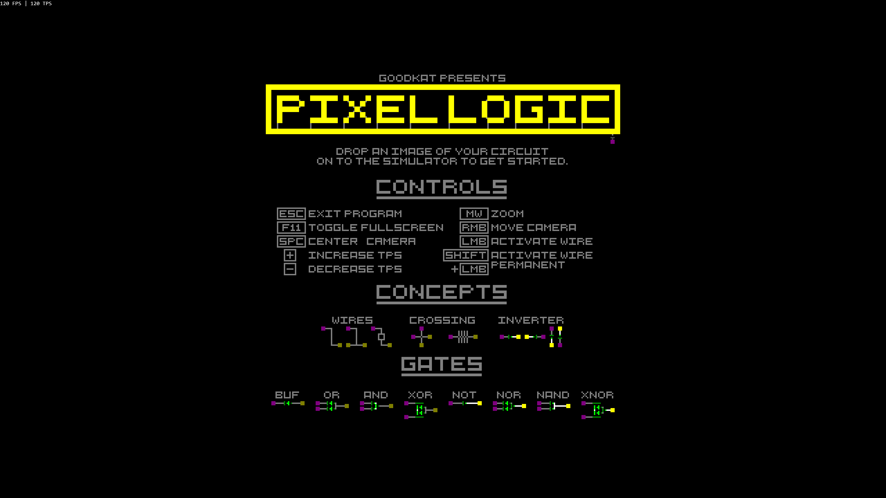

#  PIXEL LOGIC
PIXEL LOGIC is a simple and high performance logic simulator. You can use it to understand the concepts of digital electronics. Design your own circuits and become an expert.

## Getting Started
 1. Download the latest version of PIXEL LOGIC from the [releases](https://github.com/G0oDkat/pixel-logic/releases) section.
 2. Use an image editor of your choice (like Photoshop, Gimp or Paint) to cerate your circuit.
 3. Run PIXEL LOGIC and drop your image on to the simulator to see it in action.

## Inspiration

* [Wireworld](https://de.wikipedia.org/wiki/Wireworld)
* [Minecraft Redstone](https://minecraft.gamepedia.com/Mechanics/Redstone/Circuit)
* [Wired Logic](https://github.com/martinkirsche/wired-logic)
* [Bitmap Logic Simulator](https://realhet.wordpress.com/2015/09/02/bitmap-logic-simulator/)
