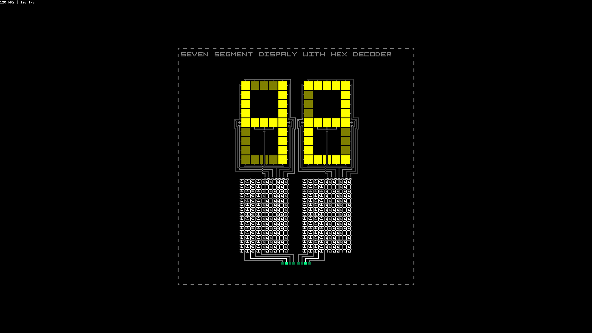

#  PIXEL LOGIC
PIXEL LOGIC is a simple and high performance logic simulator. You can use it to understand the concepts of digital electronics. Design your own circuits and become an expert.

## Getting Started
 1. Download the latest version of PIXEL LOGIC from the [releases](https://github.com/G0oDkat/pixel-logic/releases) section.
 2. Use an image editor of your choice (like Photoshop, Gimp or Paint) to cerate your circuit.
 3. Run PIXEL LOGIC and drop your image on to the simulator to see it in action.

## Samples

You can find a small collection of samples under [PixelLogic/Samples](https://github.com/G0oDkat/pixel-logic/tree/master/PixelLogic/Samples). The following images are **NOT** the sampels, but screenshot of them. Please use the real samples to get a functioning circuit.

## Metastability

This simulator does not mitigate the effects of metastability. You need to design your circuit appropriately to prevent it from entering a metastable state. Often circuits have to start in a specific state to not become metastable. You can either add some reset logic to them or add an alpha channel to your image to encode the inital state. A wire with an alpha value between 0 and 127 is inactive and wire with an alpha value between 128 and 256 is active. You can find out more about metastability [here](https://en.wikipedia.org/wiki/Metastability_(electronics))

## Inspiration

* [Wireworld](https://de.wikipedia.org/wiki/Wireworld)
* [Minecraft Redstone](https://minecraft.gamepedia.com/Mechanics/Redstone/Circuit)
* [Wired Logic](https://github.com/martinkirsche/wired-logic)
* [Bitmap Logic Simulator](https://realhet.wordpress.com/2015/09/02/bitmap-logic-simulator/)
